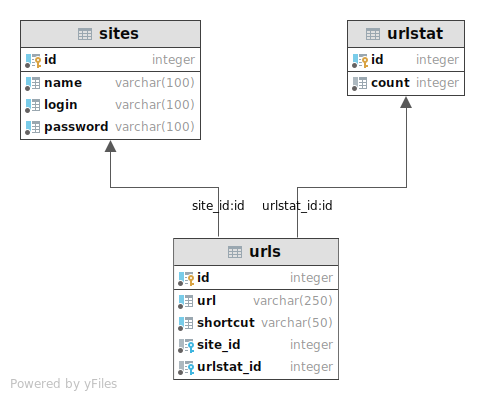

# UrlShortcut 
[](https://travis-ci.com/amasterenko/job4j_url_shortcut)  
[](https://codecov.io/gh/amasterenko/job4j_url_shortcut)  


---  
This project demonstrates the principles of the following technologies:
- Spring Boot (Web, Data, Security, Test)  
- REST API  
- JWT  
- PostgreSQL   
 
### Features  
- Sites registration   
- Sites authentication and token-based authorization     
- URLs' shortcuts generation  
- Redirecting by shortcut  
- Providing statistics of the URLs redirections      

### DB Schema



### Configuration:    
Create a PostgreSQL database with the name _urlshortcut_ and add the credentials to _/resources/application.properties_.
The default ones are :
```
spring.datasource.url=jdbc:postgresql://127.0.0.1:5432/urlshortcut
spring.datasource.username=postgres
spring.datasource.password=password
spring.datasource.driver-class-name=org.postgresql.Driver
```
Run _schema.sql_ from _resources/db_ folder on the db.  

### Usage   
Build the JAR file with
```
Linux: ./mvnw clean package  
Windows: .\mvnw.cmd clean package  
```
and then run the JAR file, as follows:  
```
java -jar target/url_shortcut-1.0.jar
```
By default, the service is available at http://localhost:8080/.  

#### 1. Site registration
_Request_:
```
curl -i -H "Content-Type: application/json"  
-X POST -d '{"site":"domain name"}' "http://localhost:8080/registration"  
```
_Response_:
```
HTTP/1.1 200  
{"password":"DrOryvDjRQ","registration":true,"login":"THM032"}   
```

#### 2. Site authorization  

_Request_:
```
curl -i -H "Content-Type: application/json"  
-X POST -d '{"login":"THM032", "password":"DrOryvDjRQ"}' "http://localhost:8080/login"    
```
_Response_:
```
HTTP/1.1 200  
Authorization: Bearer eyJ0eXAiOIU(...)x7MxYofyzESVew  
```

#### 3. URL registration (shortcuts generation)      

_Request_:
```
curl -i -H "Content-Type: application/json" -H "Authorization: Bearer eyJ0eXAiOIU(...)x7MxYofyzESVew"  
-X POST -d '{"url":"http://site/link"}' "http://localhost:8080/convert"
```
_Response_:
```
HTTP/1.1 200    
{"code":"QHL5yj"}  
```

#### 3. Redirection  

_Request_:
```
curl -i "http://localhost:8080/redirect/QHL5yj"  
```
_Response_:
```
HTTP/1.1 302    
Location: http://site/link   
```  

#### 4. Statistics on the redirects  

_Request_:
```
curl -i -H "Authorization: Bearer eyJ0eXAiOIU(...)x7MxYofyzESVew" "http://localhost:8080/statistics"  
```
_Response_:
```
HTTP/1.1 200  
[{"url":"http://site/link","total":"4"},
{"url":"http://site/link2","total":"12"}]   
```  


